# Espace-Image - Architecture Plan

## Executive Summary

Espace-Image is a single-deployable FastAPI application organized as a modular monolith. It combines shared HTTP adapters in `app/routers/` with module-owned contracts and implementations under `app/modules/`. The most important current architectural property is that business capabilities are now owned by modules, while the app still benefits from the simplicity of one process, one database, and one deployment unit.

The architecture is optimized for a low-ops household deployment model: SQLite, APScheduler, filesystem-backed media storage, and direct integrations with public ICS and Open-Meteo endpoints. The primary design trade-off is deliberate simplicity over horizontal scale.

## System Context

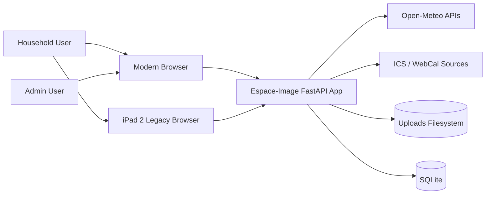

### Overview

This diagram shows Espace-Image as the system boundary between end users and the small set of external dependencies it needs.

### Key Components

- End users consume slideshow and admin experiences through browsers.
- The FastAPI app is the single runtime boundary.
- External dependencies are limited to weather and calendar sources.
- Persistent state is split between SQLite and the uploads filesystem.

### Relationships

Browsers talk only to the FastAPI app. The app owns all persistence and integration calls; clients do not talk to weather or calendar systems directly.

### Design Decisions

- Keep a single deployable application for operational simplicity.
- Use server-driven UI patterns instead of a separate frontend backend split.
- Keep external integrations narrow and replaceable through module infrastructure.

### NFR Considerations

- Scalability: adequate for a single-instance household workload.
- Performance: minimal network hops and local SQLite keep latency low.
- Security: small external surface area and internal-network deployment reduce exposure.
- Reliability: fewer moving parts reduce failure modes.
- Maintainability: modules localize domain behavior without introducing distributed-system overhead.

### Trade-offs

- Strong simplicity, weaker horizontal scale.
- Faster local iteration, less elasticity for multi-tenant or high-concurrency deployments.

### Risks and Mitigations

- Risk: SQLite and in-process scheduling limit multi-instance growth.
- Mitigation: acceptable for current deployment; revisit only if deployment model changes.

## Architecture Overview

Espace-Image uses these architectural rules:

- shared routers are HTTP adapters
- modules expose Protocol-based public contracts
- module application services coordinate logic
- module infrastructure owns external API, file, and lower-level persistence helpers
- the composition root wires dependencies at startup

## Component Architecture

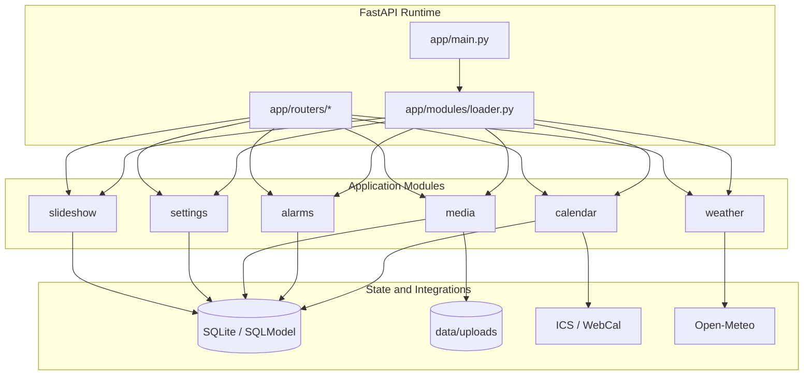

### Overview

This component view shows the composition root and the six functional modules around the shared runtime.

### Key Components

- `app/main.py`: lifecycle, scheduler, and application bootstrap.
- `app/modules/loader.py`: dependency registration and module lifecycle management.
- Shared routers: external HTTP adapters.
- Modules: capability boundaries.

### Relationships

Routers depend on module contracts. Modules depend on shared storage or external systems. The composition root creates the runtime graph.

### Design Decisions

- Keep router ownership shared for now to avoid unnecessary HTTP-layer duplication.
- Keep infrastructure private to each module.
- Avoid recreating a shared service layer.

### NFR Considerations

- Scalability: component boundaries support future extraction if ever needed.
- Performance: direct in-process calls avoid network serialization overhead.
- Security: external calls are isolated to module infrastructure.
- Reliability: composition root provides explicit wiring.
- Maintainability: module ownership keeps change impact localized.

### Trade-offs

- Shared routers mean the HTTP layer is not vertically sliced per module.
- This is acceptable because service contracts still enforce clean runtime boundaries.

### Risks and Mitigations

- Risk: routers could accumulate business logic.
- Mitigation: keep routers limited to request/response adaptation and review for boundary violations.

## Deployment Architecture

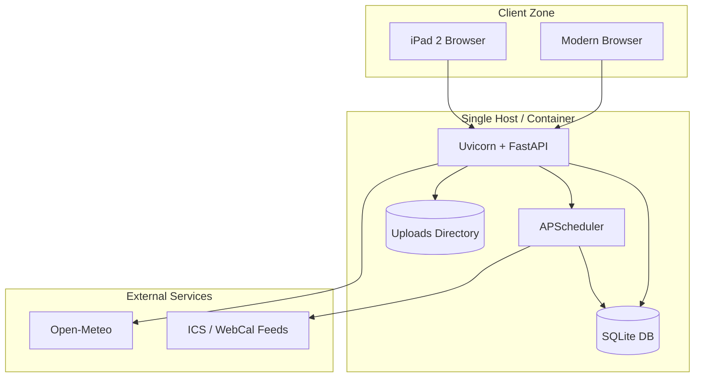

### Overview

This deployment view reflects the real operating model: one app runtime, one local DB, one local uploads store, and a small external integration surface.

### Key Components

- Uvicorn/FastAPI process hosts routes and templating.
- APScheduler runs in-process.
- SQLite and upload storage live beside the app.

### Relationships

The scheduler runs as part of the application process and writes back into the same database used by request handlers.

### Design Decisions

- Prefer a simple single-host model.
- Use SQLite and local storage because the workload and trust boundary are small.

### NFR Considerations

- Scalability: best for one instance.
- Performance: local IO is fast and operationally cheap.
- Security: internal-network deployment avoids public multi-tier complexity.
- Reliability: fewer dependencies improve operability, but local storage centralizes risk.
- Maintainability: low cognitive overhead for operators.

### Trade-offs

- No built-in horizontal scale.
- Stateful local storage complicates active-active deployment.

### Risks and Mitigations

- Risk: host failure affects both DB and uploads.
- Mitigation: document backup strategy and keep deployment model explicit.

## Data Flow

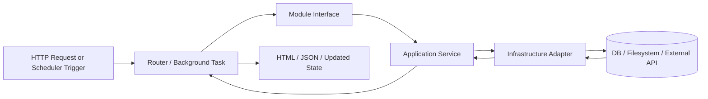

### Overview

This data flow is the normalized execution path for both request-driven and scheduled work.

### Key Components

- router or background task starts the work
- module interface defines the boundary
- application service owns orchestration
- infrastructure adapter owns low-level integration

### Relationships

The application service is the decision point; infrastructure performs side effects and data access.

### Design Decisions

- keep side effects behind infrastructure boundaries
- keep orchestrating logic out of routers
- reuse the same module layers for request and background execution when practical

### NFR Considerations

- Scalability: separable layers support later refactoring if needed.
- Performance: in-process hops are cheap.
- Security: centralizes validation and side effects in predictable places.
- Reliability: fewer ad hoc code paths.
- Maintainability: easier reasoning about change impact.

### Trade-offs

- Some infrastructure helpers remain broad because they were migrated from former shared services.

### Risks and Mitigations

- Risk: large infrastructure files can become catch-all modules.
- Mitigation: split by role within `internal/infrastructure/` as features evolve.

## Key Workflows

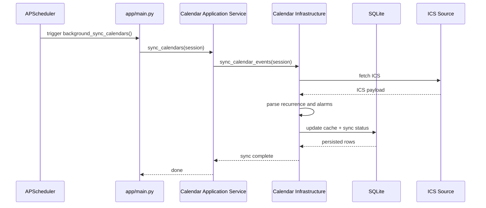

### Overview

This sequence shows the most important non-request workflow: calendar synchronization.

### Key Components

- APScheduler triggers the background job.
- `app/main.py` owns session setup and scheduler integration.
- The calendar module executes the sync.

### Relationships

The scheduler stays outside the request path, but it still routes work through the module service boundary.

### Design Decisions

- keep scheduler orchestration in `app/main.py`
- keep calendar logic in the calendar module

### NFR Considerations

- Scalability: suitable for a single process.
- Performance: direct local DB writes minimize overhead.
- Security: scheduler has no broader permissions than the app itself.
- Reliability: startup sync plus recurring sync improves eventual consistency.
- Maintainability: clear handoff between runtime and module.

### Trade-offs

- Scheduler state is tied to the app process.

### Risks and Mitigations

- Risk: missed syncs after downtime.
- Mitigation: startup sync on application boot reduces gap duration.

## Additional Diagram: Persistence Model

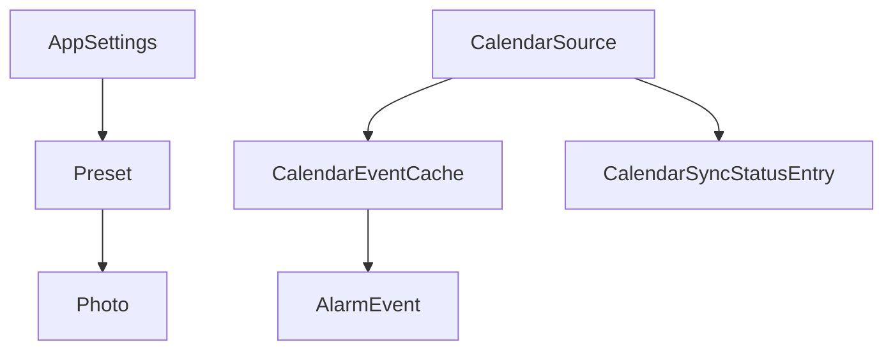

### Overview

This simplified data model highlights the stateful parts that matter most to runtime behavior.

### Key Components

- slideshow configuration depends on `AppSettings`, `Preset`, and `Photo`
- calendar behavior depends on `CalendarSource`, cached events, sync metadata, and alarms

### Relationships

Calendar data and slideshow data are separate bounded concerns that meet only at shared runtime/UI composition points.

### Design Decisions

- keep data model small and local to one SQLite database
- separate sync metadata from cached events

### NFR Considerations

- Scalability: sufficient for current volume.
- Performance: direct keyed lookups and local DB access are efficient.
- Security: local DB simplifies data exposure boundaries.
- Reliability: simpler schema is easier to recover and inspect.
- Maintainability: bounded data ownership matches module boundaries.

### Trade-offs

- SQLite is not ideal for many concurrent writers.

### Risks and Mitigations

- Risk: schema evolution pressure if multi-user features are added.
- Mitigation: keep current scope explicit and introduce migrations only when scope expands.

## Phased Development

### Phase 1: Historical Migration State

The earlier architecture used shared services and mixed responsibilities between routers and shared service files.

### Phase 2+: Current Architecture

The current state is the target state for today:

- module-owned infrastructure
- Protocol-based interfaces
- composition-root wiring
- shared routers as HTTP adapters

### Migration Path

The migration path has effectively been completed for the main service boundaries. Future architectural work should be incremental and localized rather than a second large migration campaign.

## Non-Functional Requirements Analysis

### Scalability

The architecture scales primarily by staying small and efficient on one node. It does not currently target multi-instance concurrency.

### Performance

In-process module calls, local SQLite access, and local file storage keep latency and operational overhead low.

### Security

The system benefits from a narrow external dependency surface, internal-network deployment assumptions, input validation around uploads, and server-driven rendering.

### Reliability

Reliability comes from low component count, startup sync, recurring scheduler jobs, and simple persistence choices.

### Maintainability

Maintainability is strongest where module ownership is clear. The major future risk is allowing shared routers or infrastructure files to accumulate too much domain logic.

## Risks and Mitigations

- **Single-host statefulness**: mitigate with backups and explicit deployment constraints.
- **No rate limiting for weather/geocoding**: mitigate by adding rate limiting inside weather infrastructure if traffic increases.
- **Shared routers can become too smart**: mitigate with boundary reviews and DI-based service usage.
- **Legacy browser support cost**: mitigate by isolating compatibility code to legacy templates and polyfills.

## Technology Stack Recommendations

- Keep FastAPI, SQLModel, SQLite, APScheduler, and `icalevents` for the current deployment shape.
- Do not introduce distributed infrastructure unless the deployment model changes first.
- If future scale requires it, the first likely upgrades are externalized storage, stronger rate limiting, and a DB that supports more concurrent writes.

## HTTP Boundary Refactor: GUI vs Atomic API

### Boundary Split Summary

The current application uses FastAPI routes for three different concerns at once: full-page GUI delivery, HTMX fragment delivery, and backend-style state mutation. That makes the backend contract unclear because some routes under API-like paths still return HTML, and several module public interfaces expose HTML-producing methods. The target architecture should create two explicit adapter families on top of the same module use cases:

- GUI adapters for pages and HTML fragments
- API adapters for versioned JSON commands and queries

The core rule is that module public services return DTOs and domain results, never rendered HTML. HTML rendering remains supported for the admin UI, but only as a GUI concern.

### System Context for the HTTP Split

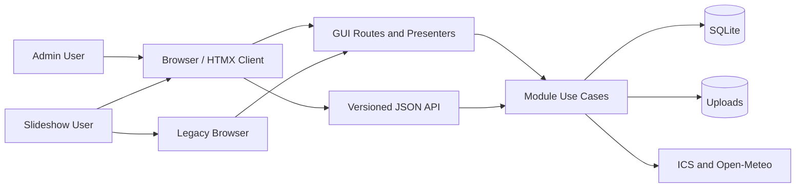

#### HTTP Split Context Overview

This context shows that the browser may consume either server-rendered HTML or JSON, but the module layer remains the single business boundary.

#### HTTP Split Context Components

- GUI routes own page rendering and fragment rendering.
- API routes own versioned JSON contracts.
- Module use cases own business decisions and persistence orchestration.

#### HTTP Split Context Relationships

Both adapter families call the same module use cases. Only the GUI path invokes presenters that transform DTOs into templates.

#### HTTP Split Context Decisions

- Keep one FastAPI deployment unit.
- Split by adapter responsibility, not by deploying a separate frontend backend.
- Remove HTML-returning methods from public module service interfaces.

#### HTTP Split Context NFR Considerations

- Scalability: separate adapters allow independent client evolution without splitting the runtime.
- Performance: GUI and API still execute in process, so the split adds clarity more than latency.
- Security: JSON endpoints become explicit and easier to protect, audit, and version.
- Reliability: clearer contracts reduce accidental UI regressions from backend changes.
- Maintainability: route purpose becomes obvious from path and response type.

#### HTTP Split Context Trade-offs

- There will be short-term duplication between HTML fragment routes and JSON routes during migration.
- Some HTMX flows may temporarily keep fragment endpoints until the admin UI is updated.

#### HTTP Split Context Risks and Mitigations

- Risk: API and GUI drift apart semantically.
- Mitigation: both must call the same module command and query services.

### Component Architecture for the Split

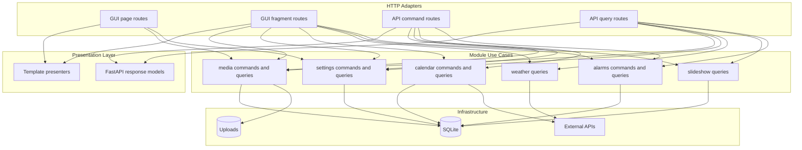

#### HTTP Split Component Overview

This component view separates HTTP concerns without changing the modular monolith core.

#### HTTP Split Component Elements

- GUI page routes: `/`, `/legacy`, `/admin`.
- GUI fragment routes: HTMX-only HTML endpoints.
- API command routes: mutations returning JSON status or resource representations.
- API query routes: read-only DTO endpoints.
- Template presenters: transform DTOs into HTML only for the GUI adapter.

#### HTTP Split Component Relationships

GUI routes may call presenters after receiving DTOs from modules. API routes serialize the same DTOs directly. Modules do not know whether the caller is GUI or API.

#### HTTP Split Component Decisions

- Keep presenter adapters out of the public module service contract.
- Use versioned JSON routes under `/api/v1/...`.
- Keep GUI routes outside `/api` even when they are fragment-oriented.

#### HTTP Split Component NFR Considerations

- Scalability: enables later SPA/mobile consumers without backend redesign.
- Performance: avoids over-fetching by exposing more atomic queries.
- Security: command routes can be scoped more tightly than generic admin form posts.
- Reliability: smaller use cases reduce blast radius.
- Maintainability: route names align with domain ownership.

#### HTTP Split Component Trade-offs

- More endpoints to document.
- More explicit DTOs and response models required.

#### HTTP Split Component Risks and Mitigations

- Risk: too many very small endpoints create chatty clients.
- Mitigation: keep atomic writes, but allow task-oriented read models where needed for admin screens.

### Deployment Architecture for the Split

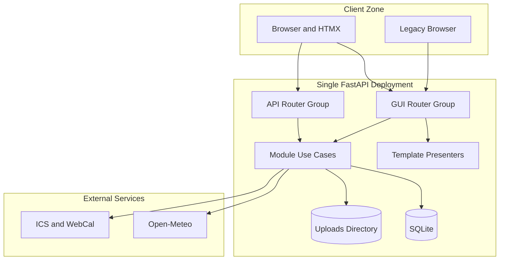

#### HTTP Split Deployment Overview

The deployment model stays single-process and low-ops. Only the internal route topology changes.

#### HTTP Split Deployment Components

- GUI router group for HTML.
- API router group for JSON.
- Shared module layer behind both.

#### HTTP Split Deployment Relationships

The same deployment serves both contracts, but they remain logically separate. Legacy browser support stays confined to the GUI side.

#### HTTP Split Deployment Decisions

- No separate BFF service or frontend deployment is required.
- Keep operational simplicity while clarifying ownership.

#### HTTP Split Deployment NFR Considerations

- Scalability: stable enough for current single-host use.
- Performance: avoids extra network hops from service decomposition.
- Security: makes it feasible to add different auth or rate policies per adapter family.
- Reliability: fewer deployment changes reduce migration risk.
- Maintainability: route grouping simplifies reasoning and testing.

#### HTTP Split Deployment Trade-offs

- The monolith still carries both UI and API concerns in one process.

#### HTTP Split Deployment Risks and Mitigations

- Risk: teams keep adding HTML endpoints under `/api` out of habit.
- Mitigation: establish a route policy and enforce it in reviews and tests.

### Data Flow for Atomic Commands and Queries

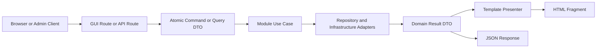

#### HTTP Split Data Flow Overview

This data flow makes the decision point explicit: a use case returns a DTO, then either a presenter renders HTML or FastAPI serializes JSON.

#### HTTP Split Data Flow Components

- Command/query DTOs formalize use case inputs.
- Domain result DTOs formalize outputs.
- Presentation happens after the use case, not inside it.

#### HTTP Split Data Flow Relationships

Command routes typically perform validation, call one mutation use case, and return a narrow JSON payload. GUI fragment routes may call the same use case and then present the result as HTML.

#### HTTP Split Data Flow Decisions

- Prefer atomic write operations.
- Allow aggregate read models for UI screens when a whole screen needs multiple related values.
- Keep file upload handling as a transport concern, but map it quickly into a module command.

#### HTTP Split Data Flow NFR Considerations

- Scalability: atomic commands are easier to expose to future clients.
- Performance: coarse reads plus atomic writes balance round trips and clarity.
- Security: narrower contracts reduce accidental overexposure.
- Reliability: single-purpose operations are easier to test.
- Maintainability: clearer mapping from user intent to use case.

#### HTTP Split Data Flow Trade-offs

- Full admin screen refreshes may be simpler than fully atomic GUI updates in some cases.

#### HTTP Split Data Flow Risks and Mitigations

- Risk: excessive command granularity for the admin UI.
- Mitigation: keep writes atomic, but let the GUI compose larger read models from dedicated query endpoints.

### Sequence Diagram: Add Image and Activate Preset

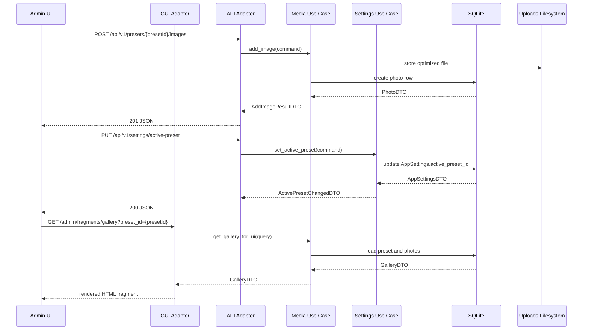

#### HTTP Split Sequence Overview

This sequence shows the intended split: mutations happen through JSON APIs, while GUI refresh remains an explicit HTML concern.

#### HTTP Split Sequence Components

- API adapter handles mutations.
- GUI adapter refreshes the visible fragment.
- Media and settings remain separate owners of their respective state.

#### HTTP Split Sequence Relationships

The media module owns image and preset media lifecycle. The settings module owns which preset is active for the slideshow because active preset is application configuration, not media storage metadata.

#### HTTP Split Sequence Decisions

- Keep ownership aligned to current domain boundaries.
- Avoid putting `set_active_preset` in media just because the noun is preset.

#### HTTP Split Sequence NFR Considerations

- Scalability: reusable command endpoints support future non-HTMX clients.
- Performance: only the fragment that changed needs to be reloaded.
- Security: write endpoints can enforce stricter validation and audit.
- Reliability: failures are isolated to one use case at a time.
- Maintainability: module ownership stays coherent.

#### HTTP Split Sequence Trade-offs

- GUI now performs one mutation call plus one fragment refresh call for some actions.

#### HTTP Split Sequence Risks and Mitigations

- Risk: client complexity increases slightly.
- Mitigation: standardize the UI mutation pattern across admin screens.

### Recommended Endpoint Taxonomy

The following examples align the API surface with module ownership and the user's requested atomic operations:

- Media commands: `POST /api/v1/presets`, `DELETE /api/v1/presets/{preset_id}`, `POST /api/v1/presets/{preset_id}/images`, `DELETE /api/v1/images/{image_id}`
- Media queries: `GET /api/v1/presets`, `GET /api/v1/presets/{preset_id}`, `GET /api/v1/presets/{preset_id}/images`
- Settings commands: `PUT /api/v1/settings/active-preset`, `PUT /api/v1/settings/slideshow`, `PUT /api/v1/settings/weather-location`
- Settings queries: `GET /api/v1/settings`
- Alarm commands: `POST /api/v1/alarms/{alarm_id}/dismiss`
- Alarm queries: `GET /api/v1/alarms/active`
- Slideshow and weather queries: `GET /api/v1/slideshow/current`, `GET /api/v1/weather/current`
- GUI-only routes: `GET /`, `GET /legacy`, `GET /admin`, `GET /admin/fragments/settings`, `GET /admin/fragments/gallery`, `GET /admin/fragments/calendars`, `GET /admin/fragments/debug`

### Atomic API Catalog by Module

The application should expose atomic commands and focused queries for every module service. Atomic does not mean CRUD-only; it means each endpoint expresses one domain action or one narrowly scoped read model.

#### Media Atomic APIs

- Commands: `POST /api/v1/presets` creates one preset; `PATCH /api/v1/presets/{preset_id}` renames one preset; `DELETE /api/v1/presets/{preset_id}` deletes one preset and its owned media according to policy; `POST /api/v1/presets/{preset_id}/images` adds one or more images to one preset; `DELETE /api/v1/images/{image_id}` removes one image.
- Queries: `GET /api/v1/presets` lists presets; `GET /api/v1/presets/{preset_id}` returns one preset; `GET /api/v1/presets/{preset_id}/images` lists images for one preset; `GET /api/v1/images/{image_id}/metadata` returns one image descriptor.
- Public service shape target: `create_preset(command) -> PresetDTO`, `rename_preset(command) -> PresetDTO`, `delete_preset(command) -> DeleteResultDTO`, `add_images(command) -> AddImagesResultDTO`, `remove_image(command) -> DeleteResultDTO`, `list_presets(query) -> list[PresetDTO]`, `list_preset_images(query) -> list[PhotoDTO]`.

#### Settings Atomic APIs

- Commands: `PUT /api/v1/settings/active-preset` sets the active slideshow preset; `PUT /api/v1/settings/slideshow-duration` sets slideshow duration; `PUT /api/v1/settings/weather-location` sets weather coordinates; `PUT /api/v1/settings/default-alarm-policy` sets the global default alarm policy.
- Queries: `GET /api/v1/settings` returns current application settings; `GET /api/v1/settings/effective` returns settings plus resolved preset and location labels for clients that need one aggregate view.
- Public service shape target: `set_active_preset(command) -> AppSettingsDTO`, `set_slideshow_duration(command) -> AppSettingsDTO`, `set_weather_location(command) -> AppSettingsDTO`, `set_default_alarm_policy(command) -> AppSettingsDTO`, `get_settings(query) -> AppSettingsDTO`.

#### Calendar Atomic APIs

- Commands: `POST /api/v1/calendar/sources` creates one calendar source; `PATCH /api/v1/calendar/sources/{source_id}` updates one source definition; `PUT /api/v1/calendar/sources/{source_id}/default-alarm` sets the per-source default alarm flag; `DELETE /api/v1/calendar/sources/{source_id}` deletes one source; `POST /api/v1/calendar/sync` triggers a sync for all sources; `POST /api/v1/calendar/sources/{source_id}/sync` triggers a sync for one source when the implementation supports it.
- Queries: `GET /api/v1/calendar/sources` lists sources; `GET /api/v1/calendar/sources/{source_id}` returns one source; `GET /api/v1/calendar/sync-status` returns sync status across sources; `GET /api/v1/calendar/events?days_back=7&days_ahead=7` returns events in a bounded window; `GET /api/v1/calendar/latest-sync` returns the latest successful sync timestamp.
- Public service shape target: `create_source(command) -> CalendarSourceDTO`, `update_source(command) -> CalendarSourceDTO`, `set_source_default_alarm(command) -> CalendarSourceDTO`, `delete_source(command) -> DeleteResultDTO`, `sync_all_sources(command) -> SyncJobResultDTO`, `sync_source(command) -> SyncJobResultDTO`, `list_sources(query) -> list[CalendarSourceDTO]`, `list_sync_status(query) -> list[SyncStatusDTO]`, `list_events_in_window(query) -> list[CalendarEventDTO]`.

#### Alarms Atomic APIs

- Commands: `POST /api/v1/alarms/{alarm_id}/dismiss` dismisses one alarm; `POST /api/v1/alarms/simulated` creates one simulated alarm for debug or test support; `POST /api/v1/alarms/purge-dismissed` purges expired dismissed alarms.
- Queries: `GET /api/v1/alarms/active` lists active alarms; `GET /api/v1/alarms/{alarm_id}` returns one alarm view if addressable in the active window; `GET /api/v1/alarms/debug/state` returns debug alarm state when debug mode is enabled.
- Public service shape target: `list_active_alarms(query) -> list[ActiveAlarmDTO]`, `dismiss_alarm(command) -> AlarmDismissalResultDTO`, `create_simulated_alarm(command) -> AlarmEventDTO`, `purge_old_dismissed_alarms(command) -> PurgeResultDTO`, `get_alarm_debug_state(query) -> AlarmDebugStateDTO`.

#### Weather Atomic APIs

- Commands: weather should usually have no mutating backend API of its own because it is a read-oriented integration module; any persistence of selected weather coordinates belongs to settings, not weather.
- Queries: `GET /api/v1/weather/current?lat={lat}&lon={lon}` returns normalized current weather for one coordinate pair; `GET /api/v1/weather/location-name?lat={lat}&lon={lon}` reverse-geocodes one coordinate pair; `GET /api/v1/weather/geocode?q={query}` geocodes one location query.
- Public service shape target: `get_current_weather(query) -> WeatherDTO`, `geocode_location(query) -> WeatherLocationResultDTO | None`, `reverse_geocode(query) -> LocationLabelDTO | None`.

#### Slideshow Atomic APIs

- Commands: slideshow should usually expose no persistent mutations because selection state is derived from settings plus media inventory; if the application later needs operator-driven control, use explicit intent endpoints such as pause, resume, or advance-once rather than a generic update endpoint.
- Queries: `GET /api/v1/slideshow/current?mode=modern` returns the current selected slide payload; `GET /api/v1/slideshow/next?mode=modern` returns the next selected slide payload if selection must remain pull-based; `GET /api/v1/slideshow/state` returns a small projection of slideshow readiness, preset, and duration.
- Public service shape target: `get_current_slide(query) -> SlideSelectionDTO`, `get_next_slide(query) -> SlideSelectionDTO`, `get_slideshow_state(query) -> SlideshowStateDTO`.

#### Cross-Module API Rules

- Media owns presets and images.
- Settings owns global application configuration, including active preset and weather coordinates.
- Calendar owns source definitions, event windows, and synchronization.
- Alarms owns active-alarm projection and dismissal lifecycle.
- Weather owns external weather and geocoding lookups only.
- Slideshow owns slide selection queries, not media mutation or settings persistence.

#### Response Conventions

- Commands return either the updated resource DTO or a narrow result DTO with explicit outcome fields.
- Queries return DTOs only and never HTML.
- Collection endpoints return stable envelopes when pagination or metadata is likely.
- Long-running commands such as sync may return `202 Accepted` with a job-style result DTO if they become asynchronous.
- Delete operations return either `204 No Content` or a minimal deletion result contract; choose one convention and keep it global.

#### Why Some Services Have Few or No Commands

Atomic APIs should follow domain behavior, not symmetry pressure. Weather and slideshow are primarily read-model services today, so forcing generic write endpoints there would create artificial contracts. The correct rule is atomic APIs for all services, but only for real commands that each service actually owns.

#### Design Rules for Route Ownership

- Anything under `/api/v1` returns JSON only.
- Anything that returns HTML lives outside `/api`.
- GUI routes may call presenter adapters; API routes may not.
- Public module service interfaces expose atomic commands and queries, not HTML helpers.
- Fragment rendering methods should move behind GUI-specific adapters or presenter ports consumed only by GUI routes.

### Phased Development Plan for the Split

#### Phase 1: Contract Cleanup

- Remove `get_*_html()` methods from public module interfaces.
- Replace them with DTO-returning commands and queries.
- Keep existing GUI routes working through temporary adapter shims where needed.

#### Phase 2: Route Family Separation

- Move HTML endpoints into a clearly named GUI router group.
- Introduce `/api/v1/...` JSON routes for atomic writes and queries.
- Stop returning HTML from any API-named route.

#### Phase 3: Admin UI Mutation Pattern

- Convert admin actions to a two-step interaction: JSON mutation first, fragment refresh second.
- Keep larger aggregate query models for fragments such as gallery and settings panels.

#### Phase 4: Contract Hardening

- Add focused tests that assert response media type and path conventions.
- Version JSON responses explicitly.
- Add a review rule preventing new HTML responses under `/api`.

#### HTTP Split Migration Path

The lowest-risk path is not a big-bang rewrite. First normalize the service interfaces so HTML is no longer part of the public module contract. Then introduce the new JSON endpoints alongside existing HTMX flows. Finally migrate admin UI actions to the new mutation pattern and retire the mixed endpoints.

### NFR Analysis for the Split

#### HTTP Split Scalability

This split improves client scalability and extraction readiness without changing the single-process deployment model.

#### HTTP Split Performance

Atomic writes and explicit query models reduce accidental overwork. The main performance risk is extra client round trips, which is why read models for fragments should remain task-oriented.

#### HTTP Split Security

Clear JSON endpoints are easier to authenticate, authorize, log, and eventually expose beyond the current admin shell if needed.

#### HTTP Split Reliability

The separation reduces ambiguity in tests and lowers the chance of breaking the GUI when changing backend state mutation logic.

#### HTTP Split Maintainability

This is the strongest argument for the change. Developers will no longer need to infer whether a route is a backend API, an HTMX fragment, or both.

### Risks and Mitigations for the Split

- Risk: temporary duplication while old fragment mutations and new JSON mutations coexist. Mitigation: migrate feature-by-feature, starting with media and settings.
- Risk: ownership confusion between media presets and active preset settings. Mitigation: document that preset lifecycle belongs to media, but active preset selection belongs to settings.
- Risk: accidental creation of CRUD-only APIs that do not match UI workflows. Mitigation: keep writes atomic, but design read endpoints around real screens and tasks.

### Recommended Migration Order Across All Services

1. Media and settings first: they carry the clearest user-facing mutations and already mix HTML with backend mutation paths.
2. Calendar second: split source management and sync into explicit command/query routes.
3. Alarms third: normalize active-alarm reads and dismissal/debug commands under JSON routes.
4. Weather and slideshow fourth: remove HTML-returning methods from public interfaces and expose read-only DTO endpoints.
5. GUI fragment routes last: keep them as presentation adapters over the new atomic service contracts until the admin UI is fully migrated.

### Implementation Roadmap

This refactor is worth doing only if it stays incremental, keeps the existing single-process deployment model, and delivers clearer contracts without destabilizing the slideshow or admin UI. The roadmap below assumes the existing composition root in `app/modules/loader.py` remains the integration point and the scheduler exception in `app/main.py` remains narrow.

#### Phase 0: Guardrails Before Refactor

- Objective: create a safe baseline before changing contracts.
- Scope: add route-level tests that assert current GUI behavior still works for `/`, `/legacy`, `/admin`, and HTMX fragment endpoints; add response-type assertions for existing JSON-style endpoints and explicitly mark mixed endpoints that will be migrated; document the route policy: `/api/v1/*` returns JSON only, GUI routes return HTML only.
- Exit criteria: the existing UI behavior is covered by smoke tests; there is a failing or pending test placeholder for any endpoint that still mixes API naming and HTML behavior.
- Stop condition: if baseline tests reveal broader instability unrelated to the boundary split, pause and stabilize first.

#### Phase 1: Public Contract Cleanup

- Objective: remove HTML from module public interfaces without changing user-visible behavior yet.
- Scope: replace `get_*_html()` methods in module public interfaces with DTO-returning commands and queries; keep presenter ports and template adapters behind GUI-facing code only; preserve existing router URLs for now by using temporary GUI adapter shims where needed.
- Affected modules first: media, settings, calendar, alarms, weather, slideshow.
- Exit criteria: no public module interface in `app/modules/*/api/interfaces.py` returns HTML; routers or GUI adapters own the final HTML rendering step.
- Stop condition: if a module requires widespread ORM or template coupling changes just to remove one HTML helper, defer deep cleanup to the later hexagonal phase rather than widening this phase.

#### Phase 2: Router Family Separation

- Objective: establish a visible HTTP boundary in the FastAPI layer.
- Scope: create clear router groups for GUI routes and API routes; introduce `/api/v1/...` JSON routes for atomic commands and focused queries; keep legacy and HTMX fragment routes outside `/api`; do not change the single-app composition or deployment model.
- Suggested target layout: GUI routes remain in the existing request/HTML adapter area; API routes are grouped by module concern under `/api/v1`.
- Exit criteria: no route under `/api/v1` returns HTML; no GUI fragment route is exposed under `/api`.
- Stop condition: if route moves create churn without removing ambiguity, keep the old paths temporarily and add only the new API paths until clients are migrated.

#### Phase 3: First Delivery Slice

- Objective: prove the approach on the highest-value write flows.
- Scope: media commands for create preset, rename preset, delete preset, add images, and remove image; settings commands for set active preset, set slideshow duration, set weather location, and set default alarm policy; GUI fragment refresh remains supported for admin panels.
- Why this slice first: it matches the most obvious user-facing mutations; it removes the largest amount of current ambiguity in `app/routers/admin.py`.
- Exit criteria: the admin UI performs mutations through JSON endpoints for media and settings flows; gallery and settings fragments are refreshed through GUI-only routes after mutation; old HTML-returning mutation routes for these flows are removed or clearly deprecated.
- Stop condition: if the UI needs excessive extra round trips, keep atomic writes but introduce task-oriented query endpoints rather than reverting to HTML mutation routes.

#### Phase 4: Calendar and Alarm Normalization

- Objective: extend the pattern to time-based and background-driven modules.
- Scope: calendar source management, sync, and event-window queries; alarm active-state queries, dismissal, simulated alarms, and debug state; preserve the scheduler wiring pattern in `app/main.py` until there is a concrete reason to change it.
- Exit criteria: calendar and alarm mutations are JSON-only APIs; debug behavior is explicitly scoped and not mixed into general GUI routes; sync semantics are clear: synchronous for now or `202 Accepted` if later made asynchronous.
- Stop condition: if sync execution semantics become unclear, freeze the API shape and decide job behavior explicitly before continuing.

#### Phase 5: Read-Oriented Service Cleanup

- Objective: finish the split for services that are mostly query-driven.
- Scope: weather read endpoints for current conditions and geocoding; slideshow read endpoints for current, next, and state projections; remove any remaining HTML-returning methods from these public interfaces.
- Exit criteria: weather and slideshow expose DTO/query contracts only; their HTML rendering survives only in GUI adapters or presenters.
- Stop condition: if no near-term client needs these JSON reads, keep the interface cleanup but defer adding extra API paths until a consumer exists.

#### Phase 6: Retirement and Hardening

- Objective: remove transitional duplication and lock the boundary.
- Scope: remove deprecated mixed endpoints; add tests that fail if any `/api/v1` route returns HTML; add tests that fail if public interfaces reintroduce HTML-returning methods; document response conventions and module ownership rules.
- Exit criteria: there are no mixed API/HTML endpoints left in active use; route purpose is inferable from path and response type alone.
- Stop condition: if the project still depends on legacy clients for some mixed path, freeze it as a compatibility route and mark it as legacy rather than blocking the rest of the cleanup.

### Acceptance Criteria for the Refactor

- All backend API routes live under `/api/v1` and return JSON only.
- All HTML page and fragment routes live outside `/api`.
- Public module interfaces expose atomic commands and queries, not rendered HTML.
- The composition root in `app/modules/loader.py` remains the source of runtime wiring.
- The scheduler path in `app/main.py` continues to call a module-owned service boundary rather than bypassing module contracts.
- Media and settings mutation flows no longer depend on HTML-returning backend mutations.
- Calendar and alarm flows have explicit command/query contracts.
- Weather and slideshow remain read-oriented unless a real owned command appears.

### Expected Payoff vs Cost

- Payoff: clearer contracts, easier route testing, easier admin UI evolution, and lower risk of backend changes accidentally breaking fragments.
- Cost: more DTOs and response models, temporary route duplication during migration, and some short-term UI orchestration complexity.

### Recommendation

Proceed with the refactor, but only through the phased plan above. The correct success condition is not architectural purity. It is reaching a state where route purpose, module ownership, and service contracts are all unambiguous while the current deployment and UI remain stable.

### Phase 0 Execution Checklist

The first concrete execution step should be test and contract scaffolding for the media/settings slice.

#### Existing Anchors to Preserve

- GUI mutation and fragment behavior currently lives in `app/routers/admin.py`.
- Media HTML helpers currently leave the public boundary through `app/modules/media/api/interfaces.py` and `app/modules/media/internal/application/service.py`.
- Settings HTML helpers currently leave the public boundary through `app/modules/settings/api/interfaces.py` and `app/modules/settings/internal/application/service.py`.
- Current settings validation coverage already exists in `tests/test_admin_settings_validation.py`.
- Media low-level image behavior already has infrastructure tests in `tests/test_image_service.py`.

#### Tests to Add Before Contract Changes

- Add route tests for the current gallery fragment behavior in `tests/test_routers.py` or a new focused admin-route test file.
- Add route tests for preset creation, image upload, and photo deletion in the admin flow, even if those routes will later be replaced.
- Add response-type assertions that document today’s mixed behavior explicitly so the migration can flip them intentionally.
- Add placeholder tests for future `/api/v1` JSON routes for media and settings commands.

#### Test Assertions That Matter

- GUI routes return `text/html` and continue to render expected partial markers.
- Future `/api/v1` routes return JSON and never set HTMX redirect semantics.
- Media mutations update both persistence state and filesystem state.
- Settings mutations preserve current validation semantics for latitude, longitude, duration, and missing preset references.

#### Phase 0 Deliverables

- A boundary-focused test layer exists before service signatures change.
- The first migration slice can be validated without relying only on manual admin testing.

### Media and Settings Contract Delta

The first slice should not start by moving routers. It should start by changing the public contracts for media and settings so the HTTP layer has something clean to target.

#### Media Interface Delta

Current public media service concerns are mixed:

- file storage helpers such as `save_upload()` and `delete_photo()`
- admin UI helpers such as `get_gallery_html()` and `get_gallery_for_ui()`
- resource lifecycle operations such as `create_preset()`, `upload_photos()`, and `delete_photo_from_db()`

Target public media service shape for the first slice:

- Commands: `create_preset(command) -> PresetDTO`, `rename_preset(command) -> PresetDTO`, `delete_preset(command) -> DeleteResultDTO`, `add_images(command) -> AddImagesResultDTO`, `remove_image(command) -> DeleteResultDTO`.
- Queries: `list_presets(query) -> list[PresetDTO]`, `get_preset(query) -> PresetDTO | None`, `list_preset_images(query) -> list[PhotoDTO]`, `get_image_metadata(query) -> PhotoDTO | None`, `get_image_payload(query) -> ImagePayloadDTO`.
- GUI-only adapters: `build_gallery_view_model(query) -> GalleryContextDTO`, `render_gallery_html(view_model) -> str`.

What should leave the public interface:

- `get_gallery_html()`
- direct storage-style methods that are implementation helpers rather than module use cases
- `delete_photo_from_db()` as a DB-shaped name rather than a domain command name

#### Settings Interface Delta

Current public settings service concerns are mixed:

- domain configuration reads and writes such as `get_settings()` and `save_settings()`
- UI form helpers such as `get_settings_form()` and `get_settings_html()`
- input validation helpers coupled to current form transport names

Target public settings service shape for the first slice:

- Commands: `set_active_preset(command) -> AppSettingsDTO`, `set_slideshow_duration(command) -> AppSettingsDTO`, `set_weather_location(command) -> AppSettingsDTO`, `set_default_alarm_policy(command) -> AppSettingsDTO`.
- Queries: `get_settings(query) -> AppSettingsDTO | None`, `list_available_presets(query) -> list[PresetDTO]`, `get_effective_settings(query) -> EffectiveSettingsDTO`.
- GUI-only adapters: `build_settings_view_model(query) -> SettingsViewModelDTO`, `render_settings_html(view_model) -> str`.

What should leave the public interface:

- `get_settings_html()`
- `get_settings_form()` as a public service concern
- one large `save_settings()` method that mixes four separate mutations into one write operation

#### Validation Placement

- Input validation that protects domain invariants should stay in command handlers or service methods.
- Transport-specific parsing concerns should stay at the route layer.
- Preview-only helpers such as location preview should move to GUI view-model assembly instead of remaining in the public application contract.

### Target Router Layout for the First Slice

The first slice should create a visible split in the FastAPI layer without forcing a full router rewrite.

#### Proposed Router Groups

- GUI routes: `app/routers/dashboard.py` for slideshow-facing pages and fragments, and `app/routers/admin.py` for admin shell and fragment queries only.
- API routes: provided by module-owned REST routers under `app/modules/*/rest/`; compatibility shims under `app/routers/api/` were used during migration and have since been removed.

#### First-Slice Route Mapping

- Keep as GUI-only: `GET /admin/`, `GET /admin/partials/gallery`, `GET /admin/partials/settings`, and `POST /admin/settings/search` until the settings preview flow is redesigned.
- Replace with JSON APIs: `POST /admin/presets` becomes `POST /api/v1/presets`, `POST /admin/upload` becomes `POST /api/v1/presets/{preset_id}/images`, `DELETE /admin/photos/{photo_id}` becomes `DELETE /api/v1/images/{image_id}`, and `POST /admin/settings` becomes four settings-oriented JSON commands or one temporary compatibility adapter that delegates to them.

#### Recommended Migration Pattern Per UI Action

For each admin write action:

1. the admin UI sends a JSON mutation request to `/api/v1/...`
2. the API route returns JSON status or the updated DTO
3. the admin UI refreshes the affected fragment from a GUI-only HTML route

This keeps writes atomic while preserving the current server-rendered admin model.

### First-Slice File Plan

The first implementation pass should touch a small, predictable set of files.

#### Likely Contract and Service Files

- `app/modules/media/api/interfaces.py`
- `app/modules/media/api/contracts.py`
- `app/modules/media/internal/application/service.py`
- `app/modules/settings/api/interfaces.py`
- `app/modules/settings/api/contracts.py`
- `app/modules/settings/internal/application/service.py`

#### Likely HTTP Adapter Files

- `app/routers/admin.py`
- module-owned REST routers under `app/modules/*/rest/`
- `app/main.py` only to include new routers if needed

#### Likely Test Files

- `tests/test_routers.py`
- `tests/test_admin_settings_validation.py`
- a new focused API route test file for media/settings commands

### First-Slice Acceptance Criteria

- Media and settings public service interfaces no longer expose HTML-returning methods.
- Media and settings atomic JSON routes exist under `/api/v1`.
- Admin gallery and settings panels still render through GUI fragment routes.
- Existing validation behavior remains intact.
- Existing slideshow and legacy routes remain untouched.
- No scheduler or module-loader changes are required for the first slice beyond normal DI wiring.

## Next Steps

1. Execute the Phase 0 checklist for media/settings tests.
2. Change the media and settings public interfaces to the first-slice contract delta.
3. Introduce module-owned REST routers under `app/modules/<module>/rest/` for atomic JSON routes (compatibility shims in `app/routers/api/` were temporary and removed).
4. Keep admin partial routes as GUI-only adapters while the UI migrates.

## Phase 4: Pure Hexagonal Closure Plan

### Objective

Close the remaining boundary leaks so the runtime can be described as a pure hexagonal modular monolith:

- routers remain HTTP adapters only
- application services orchestrate only use cases
- infrastructure adapters own persistence and external IO
- module APIs expose DTO-based ports only
- no shared ORM entities crossing module API boundaries

### Current vs Target Context

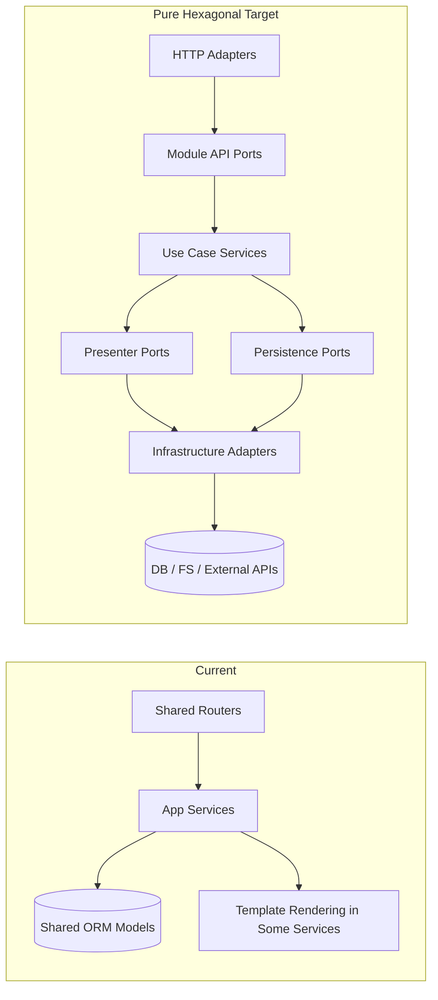

### Component Closure Map (File-by-File)

1. Router to presenter consistency
   - Current files: `app/routers/dashboard.py`, `app/routers/admin.py`
   - Gap: mixed rendering location (some fragments rendered in router, some in services)
   - Target: all HTML fragment assembly through explicit presenter ports

2. Application service to ORM coupling
   - Current files: `app/modules/alarms/internal/application/service.py`, `app/modules/calendar/internal/application/service.py`, `app/modules/media/internal/application/service.py`, `app/modules/settings/internal/application/service.py`, `app/modules/slideshow/internal/application/service.py`
   - Gap: services still execute SQLModel queries and use shared ORM entities directly
   - Target: application layer depends on repository ports; SQLModel access moves to infrastructure adapters

3. Module-owned persistence boundaries
   - Current files: `app/db/models.py` and module application services listed above
   - Gap: shared model package is a cross-module persistence dependency
   - Target: module-specific persistence adapters map storage entities to module contracts before returning

4. Presenter boundary formalization
   - Current files: `app/modules/*/api/interfaces.py`, `app/modules/*/internal/application/service.py`
   - Gap: presenter methods exist but are not consistently modeled as explicit presenter ports
   - Target: separate presenter interfaces in module API and infrastructure presenter implementations (template adapters)

5. Scheduler and background boundary purity
   - Current files: `app/main.py`, `app/modules/calendar/internal/application/service.py`
   - Gap: acceptable exception exists, but should use only public module contract and composition wiring
   - Target: background jobs instantiate services strictly through composition root factories and ports

### Target Component Diagram (Pure Hexagonal)

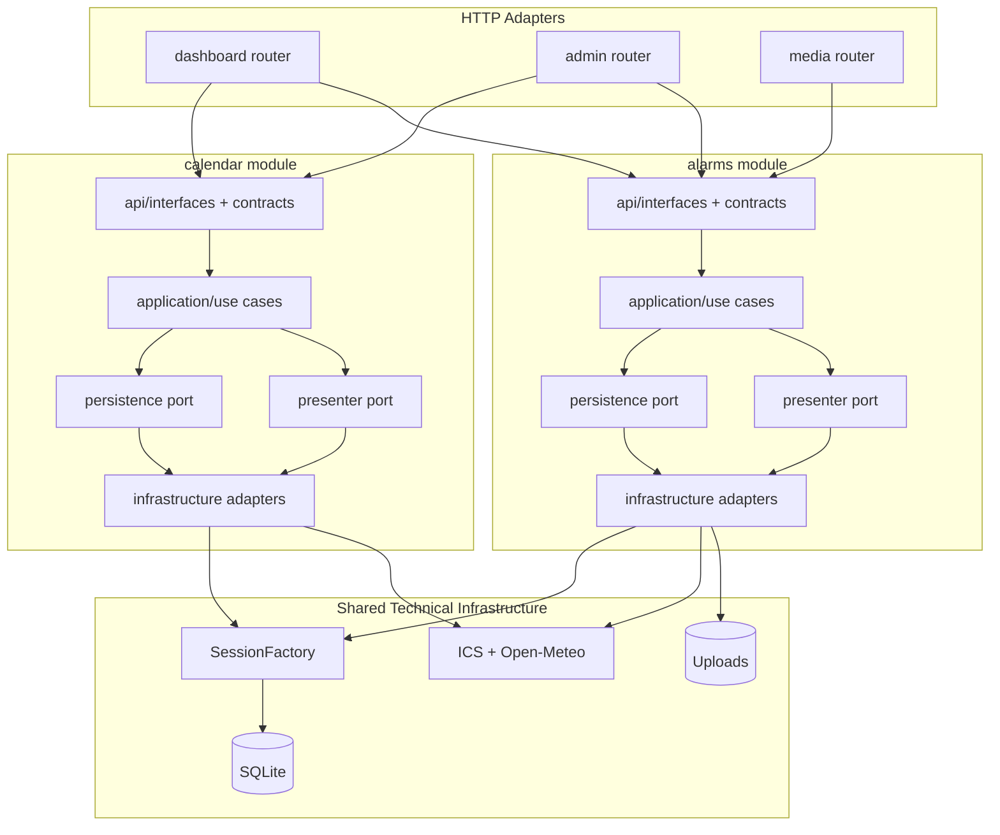

### Deployment Delta (Current to Target)

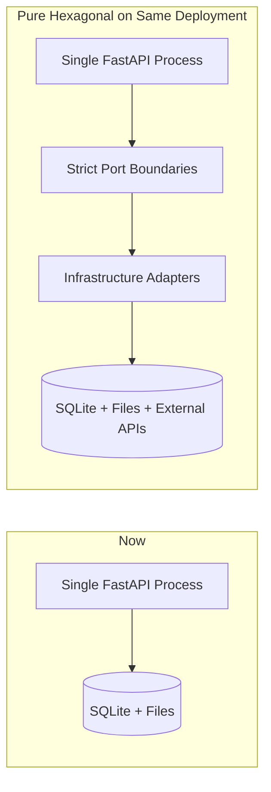

### Data Flow Delta

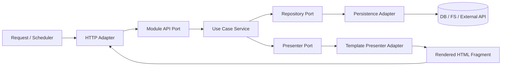

### Sequence: Admin Settings Save (Target)

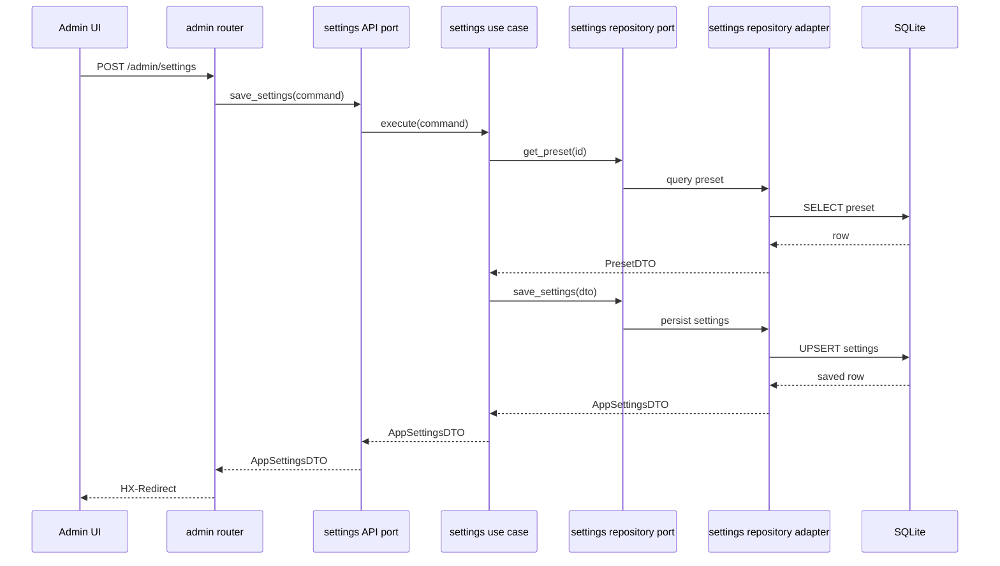

### Implementation Checklist (Execution Order)

1. Define repository ports per module in `api/`.
2. Move all SQLModel query/write logic from `internal/application/service.py` to `internal/infrastructure/` repository adapters.
3. Keep `internal/application/service.py` focused on orchestration and contract mapping.
4. Define presenter ports per module (HTML fragment output contracts).
5. Move template rendering into presenter adapters; services call presenter ports instead of direct templating.
6. Keep routers to parsing, DI, and response wrapping only.
7. Ensure cross-module calls use only API interfaces and DTOs.
8. Keep scheduler usage constrained to public service contracts and composition factories.

### Acceptance Criteria for "Pure"

1. No `select(...)` / ORM model queries inside any `internal/application/service.py`.
2. No template rendering calls inside `internal/application/service.py`.
3. Routers do not construct domain data; they only map request/response.
4. Cross-module dependencies import only from `app/modules/<module>/api/*`.
5. All module public methods return DTOs/contracts, not ORM entities.
6. All tests pass with module services resolved through DI ports.

### NFR Impact of Phase 4

- Scalability: better extraction-readiness if deployment model changes.
- Performance: minor in-process indirection overhead, negligible versus network and IO costs.
- Security: stricter boundaries reduce accidental data exposure paths.
- Reliability: clearer ownership lowers regression risk during module evolution.
- Maintainability: significantly improved; contracts become the single source of truth.

### Risks and Mitigations (Phase 4)

- Risk: short-term churn across tests and fixtures.
  - Mitigation: migrate one module at a time with contract tests.
- Risk: over-abstraction.
  - Mitigation: ports only where real boundary exists; avoid speculative interfaces.
- Risk: presenter/repository duplication.
  - Mitigation: shared patterns, but no shared domain logic layer.

### Phase 4 Completion Definition

Phase 4 is complete when all acceptance criteria are met and no module application service requires direct knowledge of SQLModel entities, template engines, or infrastructure libraries.

## Environment Variables and Docker Compose

All environment variables required for CalDAV, background sync, and debug/deployment are now exposed in `docker-compose.yml` and documented in `.env.example` and `README.md`. This ensures containerized and local runs behave identically. See the new section in `README.md` for the full list and usage guidance.
