# Espace-Image - Architecture Plan

## Executive Summary

Espace-Image is a single-deployable FastAPI application organized as a modular monolith. It combines shared HTTP adapters in `app/routers/` with module-owned contracts and implementations under `app/modules/`. The most important current architectural property is that business capabilities are now owned by modules, while the app still benefits from the simplicity of one process, one database, and one deployment unit.

The architecture is optimized for a low-ops household deployment model: SQLite, APScheduler, filesystem-backed media storage, and direct integrations with public ICS and Open-Meteo endpoints. The primary design trade-off is deliberate simplicity over horizontal scale.

## System Context

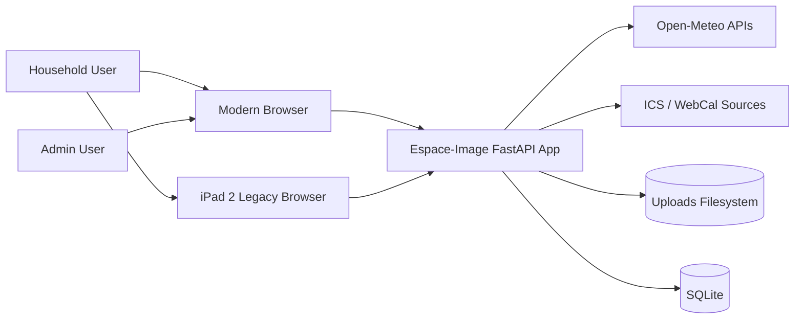

### Overview

This diagram shows Espace-Image as the system boundary between end users and the small set of external dependencies it needs.

### Key Components

- End users consume slideshow and admin experiences through browsers.
- The FastAPI app is the single runtime boundary.
- External dependencies are limited to weather and calendar sources.
- Persistent state is split between SQLite and the uploads filesystem.

### Relationships

Browsers talk only to the FastAPI app. The app owns all persistence and integration calls; clients do not talk to weather or calendar systems directly.

### Design Decisions

- Keep a single deployable application for operational simplicity.
- Use server-driven UI patterns instead of a separate frontend backend split.
- Keep external integrations narrow and replaceable through module infrastructure.

### NFR Considerations

- Scalability: adequate for a single-instance household workload.
- Performance: minimal network hops and local SQLite keep latency low.
- Security: small external surface area and internal-network deployment reduce exposure.
- Reliability: fewer moving parts reduce failure modes.
- Maintainability: modules localize domain behavior without introducing distributed-system overhead.

### Trade-offs

- Strong simplicity, weaker horizontal scale.
- Faster local iteration, less elasticity for multi-tenant or high-concurrency deployments.

### Risks and Mitigations

- Risk: SQLite and in-process scheduling limit multi-instance growth.
- Mitigation: acceptable for current deployment; revisit only if deployment model changes.

## Architecture Overview

Espace-Image uses these architectural rules:

- shared routers are HTTP adapters
- modules expose Protocol-based public contracts
- module application services coordinate logic
- module infrastructure owns external API, file, and lower-level persistence helpers
- the composition root wires dependencies at startup

## Component Architecture

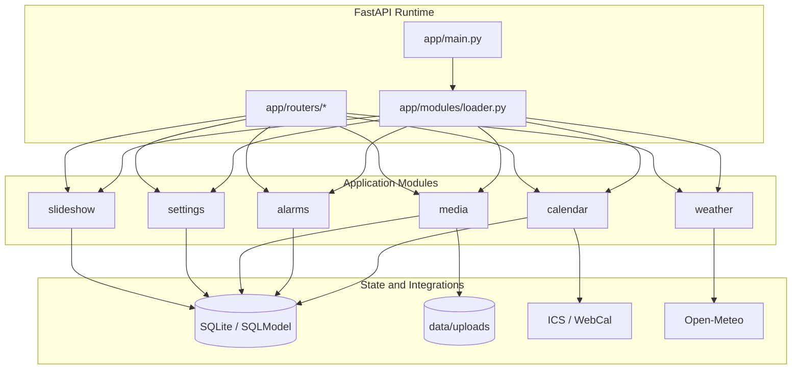

### Overview

This component view shows the composition root and the six functional modules around the shared runtime.

### Key Components

- `app/main.py`: lifecycle, scheduler, and application bootstrap.
- `app/modules/loader.py`: dependency registration and module lifecycle management.
- Shared routers: external HTTP adapters.
- Modules: capability boundaries.

### Relationships

Routers depend on module contracts. Modules depend on shared storage or external systems. The composition root creates the runtime graph.

### Design Decisions

- Keep router ownership shared for now to avoid unnecessary HTTP-layer duplication.
- Keep infrastructure private to each module.
- Avoid recreating a shared service layer.

### NFR Considerations

- Scalability: component boundaries support future extraction if ever needed.
- Performance: direct in-process calls avoid network serialization overhead.
- Security: external calls are isolated to module infrastructure.
- Reliability: composition root provides explicit wiring.
- Maintainability: module ownership keeps change impact localized.

### Trade-offs

- Shared routers mean the HTTP layer is not vertically sliced per module.
- This is acceptable because service contracts still enforce clean runtime boundaries.

### Risks and Mitigations

- Risk: routers could accumulate business logic.
- Mitigation: keep routers limited to request/response adaptation and review for boundary violations.

## Deployment Architecture

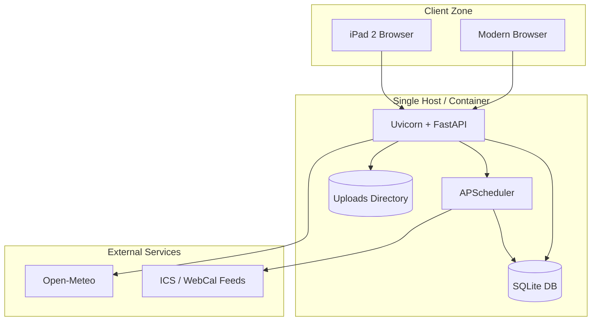

### Overview

This deployment view reflects the real operating model: one app runtime, one local DB, one local uploads store, and a small external integration surface.

### Key Components

- Uvicorn/FastAPI process hosts routes and templating.
- APScheduler runs in-process.
- SQLite and upload storage live beside the app.

### Relationships

The scheduler runs as part of the application process and writes back into the same database used by request handlers.

### Design Decisions

- Prefer a simple single-host model.
- Use SQLite and local storage because the workload and trust boundary are small.

### NFR Considerations

- Scalability: best for one instance.
- Performance: local IO is fast and operationally cheap.
- Security: internal-network deployment avoids public multi-tier complexity.
- Reliability: fewer dependencies improve operability, but local storage centralizes risk.
- Maintainability: low cognitive overhead for operators.

### Trade-offs

- No built-in horizontal scale.
- Stateful local storage complicates active-active deployment.

### Risks and Mitigations

- Risk: host failure affects both DB and uploads.
- Mitigation: document backup strategy and keep deployment model explicit.

## Data Flow

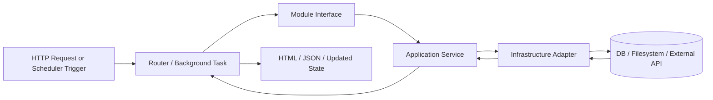

### Overview

This data flow is the normalized execution path for both request-driven and scheduled work.

### Key Components

- router or background task starts the work
- module interface defines the boundary
- application service owns orchestration
- infrastructure adapter owns low-level integration

### Relationships

The application service is the decision point; infrastructure performs side effects and data access.

### Design Decisions

- keep side effects behind infrastructure boundaries
- keep orchestrating logic out of routers
- reuse the same module layers for request and background execution when practical

### NFR Considerations

- Scalability: separable layers support later refactoring if needed.
- Performance: in-process hops are cheap.
- Security: centralizes validation and side effects in predictable places.
- Reliability: fewer ad hoc code paths.
- Maintainability: easier reasoning about change impact.

### Trade-offs

- Some infrastructure helpers remain broad because they were migrated from former shared services.

### Risks and Mitigations

- Risk: large infrastructure files can become catch-all modules.
- Mitigation: split by role within `internal/infrastructure/` as features evolve.

## Key Workflows

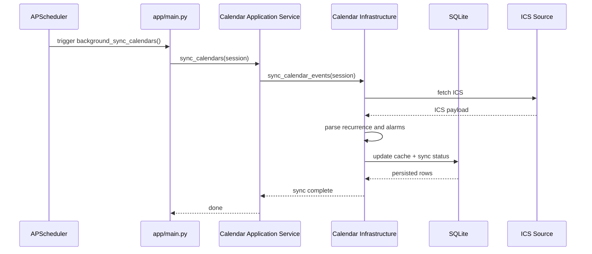

### Overview

This sequence shows the most important non-request workflow: calendar synchronization.

### Key Components

- APScheduler triggers the background job.
- `app/main.py` owns session setup and scheduler integration.
- The calendar module executes the sync.

### Relationships

The scheduler stays outside the request path, but it still routes work through the module service boundary.

### Design Decisions

- keep scheduler orchestration in `app/main.py`
- keep calendar logic in the calendar module

### NFR Considerations

- Scalability: suitable for a single process.
- Performance: direct local DB writes minimize overhead.
- Security: scheduler has no broader permissions than the app itself.
- Reliability: startup sync plus recurring sync improves eventual consistency.
- Maintainability: clear handoff between runtime and module.

### Trade-offs

- Scheduler state is tied to the app process.

### Risks and Mitigations

- Risk: missed syncs after downtime.
- Mitigation: startup sync on application boot reduces gap duration.

## Additional Diagram: Persistence Model

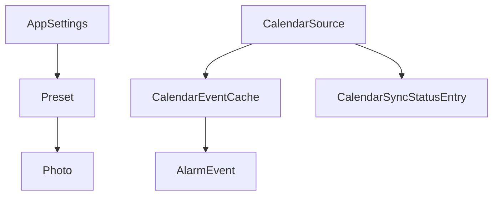

### Overview

This simplified data model highlights the stateful parts that matter most to runtime behavior.

### Key Components

- slideshow configuration depends on `AppSettings`, `Preset`, and `Photo`
- calendar behavior depends on `CalendarSource`, cached events, sync metadata, and alarms

### Relationships

Calendar data and slideshow data are separate bounded concerns that meet only at shared runtime/UI composition points.

### Design Decisions

- keep data model small and local to one SQLite database
- separate sync metadata from cached events

### NFR Considerations

- Scalability: sufficient for current volume.
- Performance: direct keyed lookups and local DB access are efficient.
- Security: local DB simplifies data exposure boundaries.
- Reliability: simpler schema is easier to recover and inspect.
- Maintainability: bounded data ownership matches module boundaries.

### Trade-offs

- SQLite is not ideal for many concurrent writers.

### Risks and Mitigations

- Risk: schema evolution pressure if multi-user features are added.
- Mitigation: keep current scope explicit and introduce migrations only when scope expands.

## Phased Development

### Phase 1: Historical Migration State

The earlier architecture used shared services and mixed responsibilities between routers and shared service files.

### Phase 2+: Current Architecture

The current state is the target state for today:

- module-owned infrastructure
- Protocol-based interfaces
- composition-root wiring
- shared routers as HTTP adapters

### Migration Path

The migration path has effectively been completed for the main service boundaries. Future architectural work should be incremental and localized rather than a second large migration campaign.

## Non-Functional Requirements Analysis

### Scalability

The architecture scales primarily by staying small and efficient on one node. It does not currently target multi-instance concurrency.

### Performance

In-process module calls, local SQLite access, and local file storage keep latency and operational overhead low.

### Security

The system benefits from a narrow external dependency surface, internal-network deployment assumptions, input validation around uploads, and server-driven rendering.

### Reliability

Reliability comes from low component count, startup sync, recurring scheduler jobs, and simple persistence choices.

### Maintainability

Maintainability is strongest where module ownership is clear. The major future risk is allowing shared routers or infrastructure files to accumulate too much domain logic.

## Risks and Mitigations

- **Single-host statefulness**: mitigate with backups and explicit deployment constraints.
- **No rate limiting for weather/geocoding**: mitigate by adding rate limiting inside weather infrastructure if traffic increases.
- **Shared routers can become too smart**: mitigate with boundary reviews and DI-based service usage.
- **Legacy browser support cost**: mitigate by isolating compatibility code to legacy templates and polyfills.

## Technology Stack Recommendations

- Keep FastAPI, SQLModel, SQLite, APScheduler, and `icalevents` for the current deployment shape.
- Do not introduce distributed infrastructure unless the deployment model changes first.
- If future scale requires it, the first likely upgrades are externalized storage, stronger rate limiting, and a DB that supports more concurrent writes.

## Next Steps

1. Keep architecture docs synchronized whenever module boundaries change.
2. Add focused module-level tests only when new behavior is introduced.
3. Review large infrastructure files periodically and split them by role if they become too broad.
4. Revisit rate limiting and deployment assumptions only if traffic or hosting requirements materially change.

## Phase 4: Pure Hexagonal Closure Plan

### Objective

Close the remaining boundary leaks so the runtime can be described as a pure hexagonal modular monolith:

- routers remain HTTP adapters only
- application services orchestrate only use cases
- infrastructure adapters own persistence and external IO
- module APIs expose DTO-based ports only
- no shared ORM entities crossing module API boundaries

### Current vs Target Context

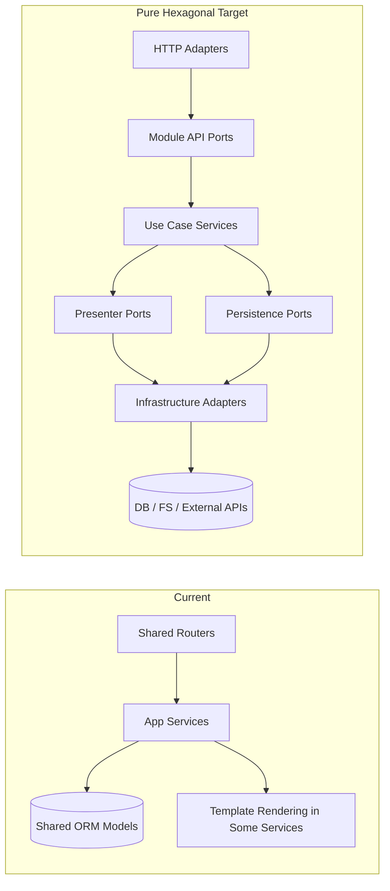

### Component Closure Map (File-by-File)

1. Router to presenter consistency
   - Current files: `app/routers/dashboard.py`, `app/routers/admin.py`
   - Gap: mixed rendering location (some fragments rendered in router, some in services)
   - Target: all HTML fragment assembly through explicit presenter ports

2. Application service to ORM coupling
   - Current files: `app/modules/alarms/internal/application/service.py`, `app/modules/calendar/internal/application/service.py`, `app/modules/media/internal/application/service.py`, `app/modules/settings/internal/application/service.py`, `app/modules/slideshow/internal/application/service.py`
   - Gap: services still execute SQLModel queries and use shared ORM entities directly
   - Target: application layer depends on repository ports; SQLModel access moves to infrastructure adapters

3. Module-owned persistence boundaries
   - Current files: `app/db/models.py` and module application services listed above
   - Gap: shared model package is a cross-module persistence dependency
   - Target: module-specific persistence adapters map storage entities to module contracts before returning

4. Presenter boundary formalization
   - Current files: `app/modules/*/api/interfaces.py`, `app/modules/*/internal/application/service.py`
   - Gap: presenter methods exist but are not consistently modeled as explicit presenter ports
   - Target: separate presenter interfaces in module API and infrastructure presenter implementations (template adapters)

5. Scheduler and background boundary purity
   - Current files: `app/main.py`, `app/modules/calendar/internal/application/service.py`
   - Gap: acceptable exception exists, but should use only public module contract and composition wiring
   - Target: background jobs instantiate services strictly through composition root factories and ports

### Target Component Diagram (Pure Hexagonal)

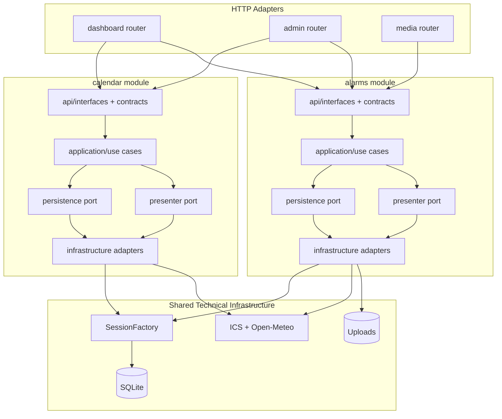

### Deployment Delta (Current to Target)

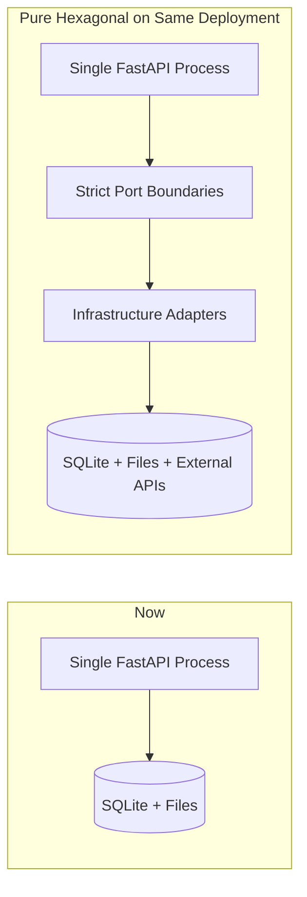

### Data Flow Delta

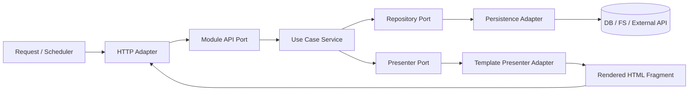

### Sequence: Admin Settings Save (Target)

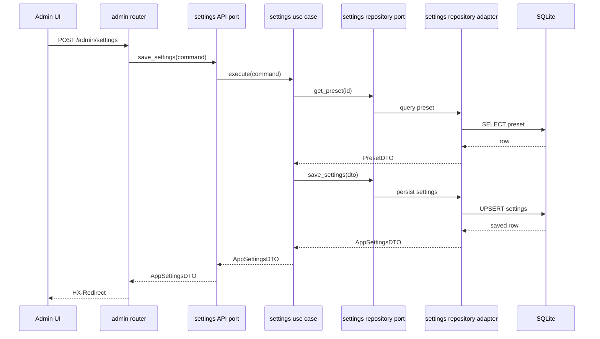

### Implementation Checklist (Execution Order)

1. Define repository ports per module in `api/`.
2. Move all SQLModel query/write logic from `internal/application/service.py` to `internal/infrastructure/` repository adapters.
3. Keep `internal/application/service.py` focused on orchestration and contract mapping.
4. Define presenter ports per module (HTML fragment output contracts).
5. Move template rendering into presenter adapters; services call presenter ports instead of direct templating.
6. Keep routers to parsing, DI, and response wrapping only.
7. Ensure cross-module calls use only API interfaces and DTOs.
8. Keep scheduler usage constrained to public service contracts and composition factories.

### Acceptance Criteria for "Pure"

1. No `select(...)` / ORM model queries inside any `internal/application/service.py`.
2. No template rendering calls inside `internal/application/service.py`.
3. Routers do not construct domain data; they only map request/response.
4. Cross-module dependencies import only from `app/modules/<module>/api/*`.
5. All module public methods return DTOs/contracts, not ORM entities.
6. All tests pass with module services resolved through DI ports.

### NFR Impact of Phase 4

- Scalability: better extraction-readiness if deployment model changes.
- Performance: minor in-process indirection overhead, negligible versus network and IO costs.
- Security: stricter boundaries reduce accidental data exposure paths.
- Reliability: clearer ownership lowers regression risk during module evolution.
- Maintainability: significantly improved; contracts become the single source of truth.

### Risks and Mitigations (Phase 4)

- Risk: short-term churn across tests and fixtures.
  - Mitigation: migrate one module at a time with contract tests.
- Risk: over-abstraction.
  - Mitigation: ports only where real boundary exists; avoid speculative interfaces.
- Risk: presenter/repository duplication.
  - Mitigation: shared patterns, but no shared domain logic layer.

### Phase 4 Completion Definition

Phase 4 is complete when all acceptance criteria are met and no module application service requires direct knowledge of SQLModel entities, template engines, or infrastructure libraries.
