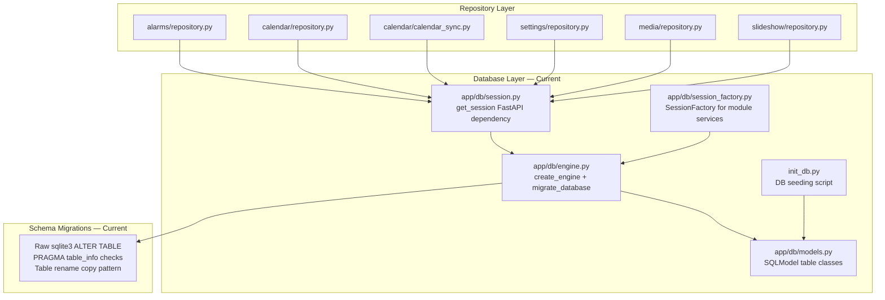
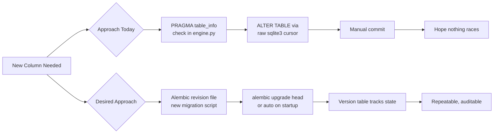
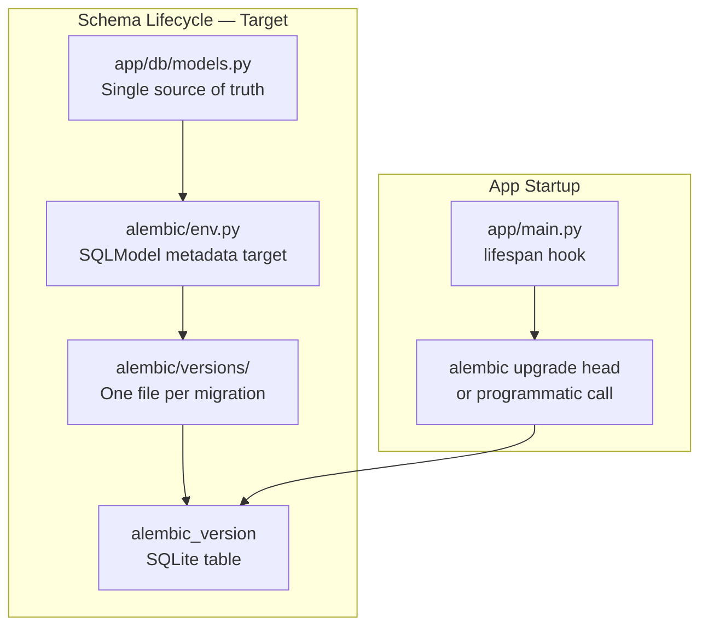
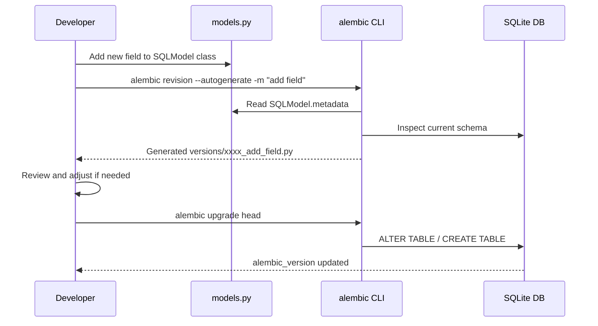

# Espace-Image — Database Layer Blueprint

## Executive Summary

The persistence layer is healthy today: SQLModel is consistently used for all active data access, Pylance typing is clean, and 72 tests pass. The single structural gap is the schema migration subsystem. Migrations are currently implemented as hand-rolled sqlite3 calls inside `app/db/engine.py`. This approach works but does not scale safely as the schema continues to grow. This blueprint documents the current state, maps the gaps, and defines a phased path to a formal migration system with full SQLModel type fidelity.

---

## Current State

### Database Layer Component Map



### Key Observations

| Area | Status | Note |
|---|---|---|
| SQLModel models | ✅ Consistent | All table classes in `app/db/models.py` |
| Session management | ✅ Consistent | `Session` used everywhere; `SessionFactory` for modules |
| Repository pattern | ✅ Consistent | All six modules have isolated repositories |
| Typing fidelity | ✅ Clean | All Pylance errors resolved; `cast(Any, ...)` used for nullable column filters |
| SQLAlchemy mix | ✅ Acceptable | Only `UniqueConstraint`, `selectinload`, `and_`, and `Engine` type imported directly — all composable with SQLModel |
| Schema migrations | ⚠️ Manual | `migrate_database()` in `engine.py` uses raw sqlite3 cursor calls and PRAGMA introspection |
| Seed script | ⚠️ Standalone | `init_db.py` runs outside FastAPI DI and calls `SQLModel.metadata.create_all()` directly |

---

## Gap Analysis

### Migration Subsystem Gaps



**Specific problems with the current approach:**

1. **No version tracking.** There is no `alembic_version` or equivalent table. Re-running the app always re-executes all PRAGMA checks even when nothing has changed.
2. **Fragile rename/copy pattern.** The `alarmevent` table reconstruction in `engine.py` (lines 123–195) does a create-copy-drop-rename dance that is not transactional on failure. A crash mid-migration leaves the database in an unknown state.
3. **Opaque history.** There is no log of which migrations have been applied to any given database file. This is unrecoverable if migrations diverge between environments.
4. **Growing complexity.** Each new column adds another PRAGMA block. `migrate_database()` is already over 170 lines for what are essentially 8 small migrations.

### Typing Gaps

```mermaid
flowchart LR
    A[SQLModel nullable column\ne.g. dismissed_at: datetime | None] --> B[Column attribute\nAlarmEvent.dismissed_at]
    B --> C{Access pattern}
    C --> D[.is_\(None\)\n.isnot\(None\)\ncomparison operators]
    D --> E{Pylance sees type}
    E --> F[datetime | None\nnot a column descriptor]
    F --> G[Type errors: isnot unknown\noperator < not supported for None]
    G --> H[Workaround:\ncast\(Any, AlarmEvent.dismissed_at\)]
```

The `cast(Any, ...)` workaround is safe at runtime but loses static safety. This is a known SQLModel/Pylance limitation for nullable and optional columns accessed as class-level attributes. Two mitigation paths exist: use `col()` from SQLModel (which wraps column expressions), or accept `cast(Any, ...)` as the project-wide pattern with a documented convention.

---

## Target Architecture

### Migration System — Target State



### Data Flow for a New Column



---

## Phased Implementation Plan

### Phase 1 — Stabilize Typing Convention (no breaking changes)

**Scope**: Establish and document the `cast(Any, ...)` pattern as the official workaround for nullable column filters.

**Changes:**

- Add a short doc note in `docs/` (or as a comment block at the top of each affected repository file) explaining why `cast(Any, col)` is used for nullable SQLModel columns in filter expressions.
- Audit `calendar/repository.py` and `calendar/calendar_sync.py` for any remaining untyped `.all()` return values that could be `list[...]` versus `Sequence[...]`.
- Set `reportUnknownMemberType = "none"` in `pyproject.toml` pyrightconfig only for the known SQLModel column descriptor limitation, if team prefers fewer suppression comments inline.

**Effort**: ~1 hour
**Risk**: None — documentation and minor suppressions only.

---

### Phase 2 — Introduce Alembic (parallel to current migrations)

**Scope**: Wire Alembic into the project without removing the existing `migrate_database()` function yet.

**Steps:**

1. Add `alembic` to `pyproject.toml` dependencies.
2. Run `alembic init alembic` to scaffold the directory.
3. Edit `alembic/env.py` to point at `SQLModel.metadata` and use the existing `engine`.
4. Generate initial migration baseline: `alembic revision --autogenerate -m "baseline"`. Review the generated file and stamp the current production DB: `alembic stamp head`.
5. Add an Alembic upgrade call to `app/main.py` lifespan startup, guarded so it only runs when `alembic_version` is present (opt-in for existing deployments).
6. Document the rollout in `docs/ADR/`.

**Effort**: ~3–4 hours
**Risk**: Low — existing `migrate_database()` still runs; Alembic is additive only.

---

### Phase 3 — Migrate Historical Migrations to Alembic

**Scope**: Convert each existing raw migration into a proper Alembic revision file.

**Migration inventory to convert:**

| # | Table | Change | Current Location |
|---|---|---|---|
| 1 | `appsettings` | `default_alarm_for_all_events` column | `engine.py:37–46` |
| 2 | `calendar_event_cache` | `trigger_time` column + index | `engine.py:48–63` |
| 3 | `calendar_event_cache` | `optional_trigger` column + index | `engine.py:65–76` |
| 4 | `calendar_event_cache` | `event_tz` column + index | `engine.py:78–89` |
| 5 | `calendar_event_cache` | `all_day` column + index | `engine.py:91–101` |
| 6 | `calendarsource` | `default_alarm_for_all_events` column | `engine.py:103–119` |
| 7 | `alarmevent` | Full table reconstruction (UUID PK migration) | `engine.py:121–195` |

Each becomes one Alembic revision. The table reconstruction (#7) becomes a proper `op.create_table` / `op.bulk_insert` / `op.drop_table` sequence with explicit transaction control.

**Effort**: ~4–6 hours
**Risk**: Medium — requires testing against an existing DB file, not just the in-memory test fixture.

---

### Phase 4 — Remove migrate_database()

**Scope**: Delete the raw sqlite3 migration code once Alembic is verified to handle all existing cases.

**Steps:**

1. Verify all Phase 3 migration files apply cleanly to a copy of the production DB.
2. Remove `migrate_database()` from `engine.py`.
3. Remove `import sqlite3` from `engine.py`.
4. Update `app/main.py` startup sequence to remove the `migrate_database()` call.
5. Update tests to confirm the startup path still works with in-memory SQLite.
6. Update `CODEBASE_EXPLORATION_SUMMARY.md` and `memory-bank/systemPatterns.md` to reflect the new migration approach.

**Effort**: ~2 hours
**Risk**: Low once Phase 3 is validated.

---

## Non-Functional Requirements Analysis

### Reliability

The current approach has a data-safety gap in the alarmevent table reconstruction (Phase 3 item #7). A crash mid-way leaves the database without an `alarmevent` table. Alembic executes migrations inside a transaction where the database supports it, providing atomic rollback on failure.

### Maintainability

Adding a new schema column today requires: (a) modifying `models.py`, (b) adding a PRAGMA block in `engine.py`, (c) writing raw SQL. With Alembic: (a) modify `models.py`, (b) run `alembic revision --autogenerate`. The autogenerate path reduces error surface and keeps `engine.py` clean.

### Security

Raw `sqlite3.connect()` calls open a second connection to the SQLite file, bypassing the SQLAlchemy connection pool and its configuration (e.g., `check_same_thread`). Alembic uses the same engine, eliminating this dual-connection pattern.

### Performance

No measurable change. Alembic upgrade at startup is a metadata check against the `alembic_version` table (one SELECT) when no new migrations exist.

### Testability

In-memory SQLite tests already use `SQLModel.metadata.create_all()` and do not exercise `migrate_database()`. Alembic's test pattern replaces this with `alembic upgrade head` against the in-memory engine, giving tests the same migration path as production — catching any future migration that creates an incompatible schema.

---

## Technology Stack

| Layer | Current | Target |
|---|---|---|
| ORM | SQLModel (wraps SQLAlchemy 2.x) | No change |
| Migration system | Hand-rolled sqlite3 | Alembic with SQLModel autogenerate |
| Session management | `Session(engine)` + `SessionFactory` | No change |
| Models | `SQLModel, table=True` | No change |
| Typing suppressions | `cast(Any, col)` for nullable filters | Documented convention, no change |

---

## Risks and Mitigations

| Risk | Likelihood | Impact | Mitigation |
|---|---|---|---|
| Alembic autogenerate misses a SQLite-specific column type | Low | Low | Review each generated file before applying; add manual ops where needed |
| Existing DB files at a state not matching any Alembic revision | Medium | Medium | Use `alembic stamp head` on existing installs before enabling auto-upgrade |
| Phase 3 table reconstruction fails on production data | Low | High | Test Phase 3 on a DB file snapshot before removing `migrate_database()` |
| Alembic version table conflicts with an existing table name | Very Low | Low | Alembic uses `alembic_version` by default; verify it does not collide with models |

---

## Next Steps

1. **Immediate (Phase 1):** Document the `cast(Any, col)` typing pattern convention in `docs/` and check `calendar/repository.py` for untyped `.all()` returns.
2. **Near term (Phase 2):** Add Alembic, wire to `SQLModel.metadata`, generate baseline, stamp existing DB.
3. **Follow-on (Phase 3):** Convert all 7 historical migrations to Alembic revision files.
4. **Cleanup (Phase 4):** Delete `migrate_database()`, remove `import sqlite3` from `engine.py`.

Each phase is independently mergeable and independently testable. Phases 2–4 should be accompanied by an ADR entry in `docs/ADR/`.
